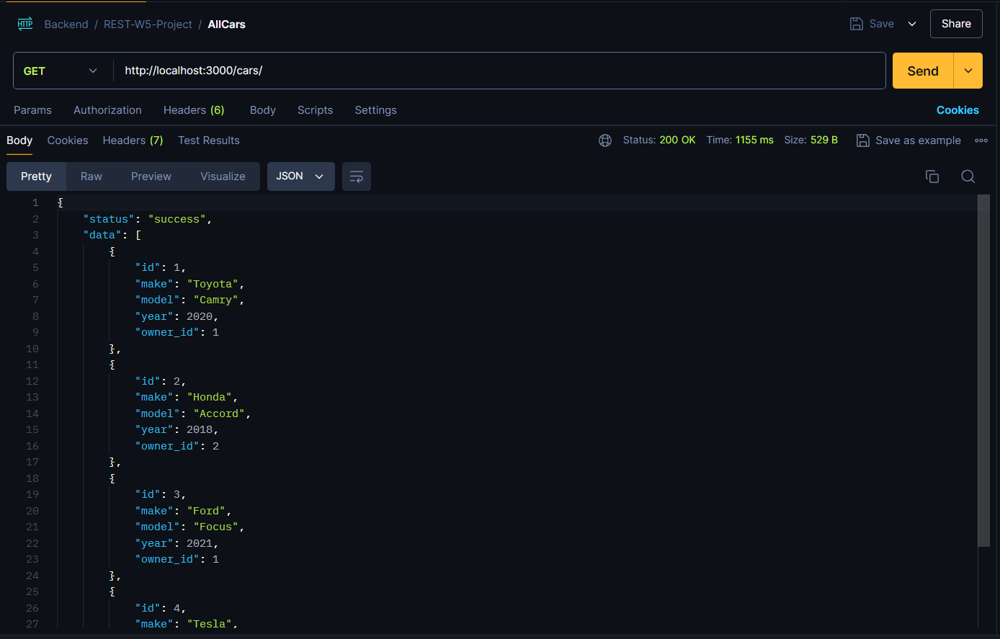
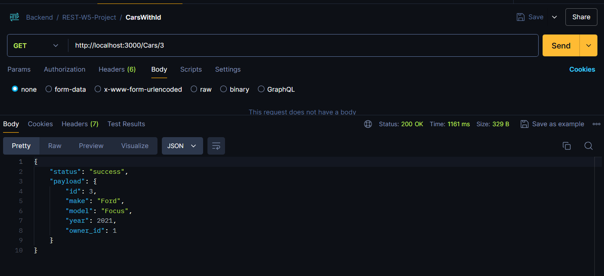
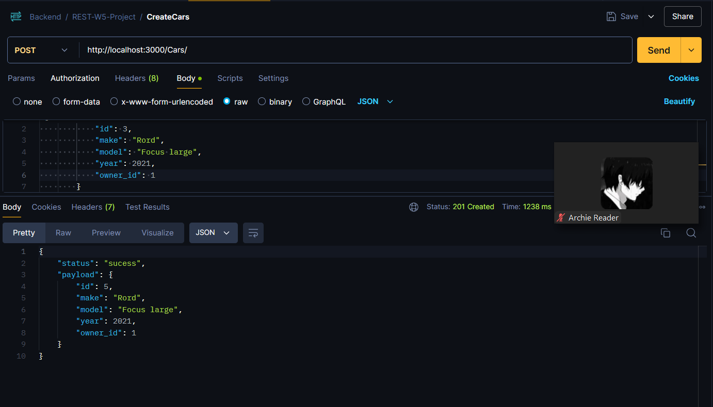
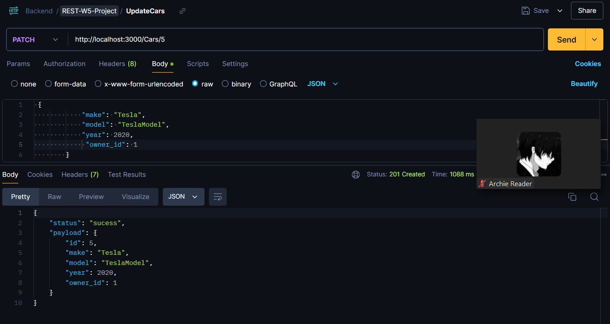
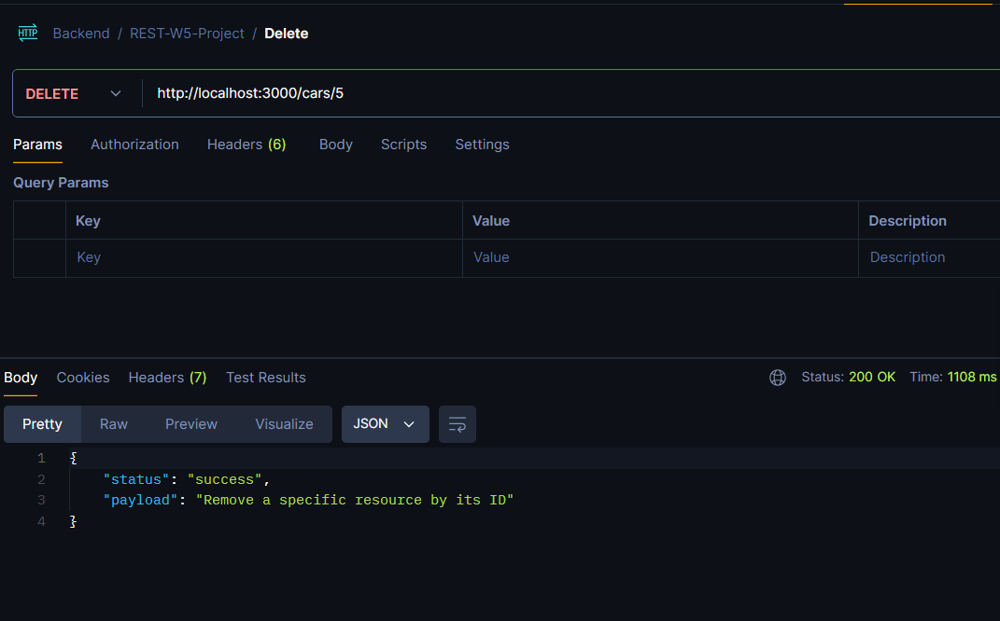

## 
REST Full API

A hands-on project to enhance JavaScript, Nodejs, Express, Postman, SQL queries, Postgersql, REST API skills for backend Project.
## Get End-point View

## Get with ID View

## Post End-point View

## Patch End-point View

## Delete End-point View

##  Acknowledgements

We am grateful to the SOC Bootcamp for providing this project as part of my week 5 learning. Their structured guidance and resources were instrumental in developing our backend development skills. Using Node.js, Express, PostgreSQL, and Postman, I built a robust RESTful API. This project significantly enhanced our backend development skills, and we are proud of the results achieved.

##  Features

- RESTful API: Implements standard RESTful principles for API design.
- Modern Node.js Components: Utilizes the Express framework for building the backend.
- Testing with Postman: Facilitates API testing and debugging with Postman.
- Custom JavaScript Functionality: Includes custom JavaScript code and CRUD functionality using Node.js.
##  Tech Stack

  
  
  

##  Lessons Learned

Building this Backend API project with Nodejs, Express, PG, POLL, postegarsql and POSTMAN taught me valuable lessons in design backend api, state management, and modular component development.
Challenges & Solutions

### REST API Design:
Ensured consistency across POSTMAN through rigorous testing and design principles.

### Component Reusability:
Achieved modularity and simplicity through iterative refactoring and peer feedback.

### Conclusion
This project sharpened our back-end development skills and prepared us for future challenges in REST API development.

##  Installation of Nodejs + Express + PG + POSTMAN 

This template provides a minimal setup for configuring a Node.js application with a PostgreSQL database, and for testing your REST API with Postman.
### Clone the repository:
* git clone https://github.com/yourusername/your-project.git
* cd your-project
### Install dependencies:

* npm install

This command installs all necessary dependencies, including Express, Nodemon, pg, Morgan, and other packages specified in package.json.

### reset-database:
* npm run reset-database

This resets the database queries with the server so you can update your changes and test on Postman.

### Start the development server:
* npm run dev

### Additional Notes

* Save credential data inside the .env file and add it to the .gitignore file for security purposes.

* Modify scripts/reset-database.js to include additional queries and data for global database changes as needed.
    
* Ensure Node.js and npm are installed on your machine before proceeding with the installation steps.